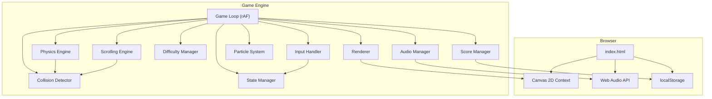
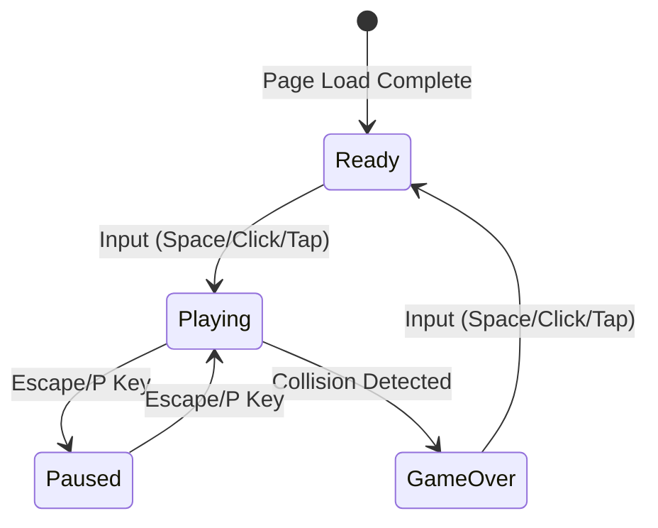

# Design Document: Flappy Kiro

## Overview

Flappy Kiro is a retro-styled endless side-scrolling browser game implemented as a single HTML5 page with embedded JavaScript. The game uses the Canvas 2D API for all rendering, with no external frameworks or libraries. The architecture follows a game-loop pattern with clearly separated subsystems for physics, rendering, collision detection, scoring, audio, and difficulty progression.

The player controls a ghost character (rendered from `ghosty.png`) that navigates through gaps between green pipe pairs. The game features parallax cloud backgrounds for depth, floating collectibles for bonus points, particle effects, screen shake on collision, progressive difficulty scaling, and pause/resume functionality.

**Key Technical Decisions:**
- Single HTML file with embedded `<script>` — no build step, no bundler, immediate browser playability
- Fixed logical resolution (480×640) with CSS scaling to fill the viewport while preserving aspect ratio
- `requestAnimationFrame` game loop with delta-time scaling for frame-rate independence
- All game state managed in a single `GameState` object passed through the update/render pipeline
- Centralized `CONFIG` object for all tunable parameters with URL query parameter overrides for rapid playtesting
- Web Audio API for low-latency sound effects; `HTMLAudioElement` fallback for background music
- `localStorage` for high score persistence with graceful degradation

## Architecture

### High-Level Architecture



### Game Loop Pipeline

Each frame executes the following pipeline in order:

```mermaid
sequenceDiagram
    participant RAF as requestAnimationFrame
    participant Loop as GameLoop
    participant Input as InputHandler
    participant State as StateManager
    participant Physics as PhysicsEngine
    participant Scroll as ScrollingEngine
    participant Coll as CollisionDetector
    participant Diff as DifficultyManager
    participant Score as ScoreManager
    participant Part as ParticleSystem
    participant Render as Renderer

    RAF->>Loop: callback(timestamp)
    Loop->>Loop: Calculate deltaTime
    Loop->>Input: pollInputs()
    Loop->>State: processStateTransitions(inputs)
    Loop->>Physics: update(ghost, dt)
    Loop->>Scroll: update(pipes, collectibles, clouds, dt)
    Loop->>Coll: check(ghost, pipes, boundaries)
    Loop->>Diff: evaluate(score)
    Loop->>Score: update(ghost, pipes, collectibles)
    Loop->>Part: update(ghost, dt)
    Loop->>Render: draw(gameState)
    Loop->>RAF: requestAnimationFrame(loop)
```

### State Machine



## Components and Interfaces

### 1. GameLoop

The central orchestrator that drives the frame update cycle.

```javascript
// GameLoop interface
{
  start(): void           // Begin the rAF loop
  stop(): void            // Cancel the rAF loop
  tick(timestamp: number): void  // Single frame execution
}
```

**Responsibilities:**
- Calculates delta-time between frames, clamping to prevent spiral-of-death (max dt = 33ms ≈ 30fps)
- Calls subsystems in deterministic order
- Manages the `requestAnimationFrame` lifecycle

### 2. InputHandler

Captures and normalizes player input from multiple sources.

```javascript
// InputHandler interface
{
  init(canvas: HTMLCanvasElement): void
  pollJump(): boolean     // Returns true if jump was triggered since last poll (consumed on read)
  pollPause(): boolean    // Returns true if pause was triggered since last poll
  reset(): void           // Clear all buffered inputs
}
```

**Input Sources:**
- `keydown` event: Spacebar (jump), Escape/P (pause)
- `mousedown` event on canvas (jump)
- `touchstart` event on canvas (jump)

**Design Notes:**
- Inputs are buffered as flags and consumed on poll to prevent double-processing
- Pause inputs are separate from jump inputs to avoid accidental jumps on resume (Req 7.9)

### 3. StateManager

Controls game state transitions and validates transition legality.

```javascript
// StateManager interface
{
  currentState: GameState           // 'ready' | 'playing' | 'paused' | 'game_over'
  transition(event: GameEvent): void
  isPlaying(): boolean
  isPaused(): boolean
  isReady(): boolean
  isGameOver(): boolean
}
```

### 4. PhysicsEngine

Applies forces and velocity to the Ghost character.

```javascript
// PhysicsEngine interface
{
  update(ghost: Ghost, dt: number, state: GameState): void
  applyJump(ghost: Ghost): void
}
```

**Constants (tunable):**
- `GRAVITY`: 0.5 px/frame² (applied per-frame, scaled by dt)
- `JUMP_VELOCITY`: -7 px/frame (upward)
- `TERMINAL_VELOCITY_DOWN`: 10 px/frame
- `TERMINAL_VELOCITY_UP`: -9 px/frame

**Algorithm:**
```
if state == Playing:
    ghost.velocity += GRAVITY * dt
    ghost.velocity = clamp(ghost.velocity, TERMINAL_VELOCITY_UP, TERMINAL_VELOCITY_DOWN)
    ghost.y += ghost.velocity * dt
```

### 5. ScrollingEngine

Manages horizontal movement of pipes, collectibles, and clouds. Uses object pooling for memory efficiency.

```javascript
// ScrollingEngine interface
{
  update(gameObjects: GameObjects, dt: number, difficulty: DifficultyParams, state: GameState): void
  spawnPipePair(difficulty: DifficultyParams): PipePair
  spawnCollectible(prevPipe: PipePair, nextPipe: PipePair, difficulty: DifficultyParams): Collectible | null
  spawnCloud(layer: number): Cloud
  removeOffscreen(gameObjects: GameObjects): void
}
```

**Responsibilities:**
- Moves all scrollable objects left at their respective speeds
- Generates new pipe pairs when the rightmost pipe pair is far enough from the right edge
- Spawns collectibles between pipe pairs with probability check
- Manages cloud recycling across parallax layers
- Clouds continue scrolling in Ready and GameOver states (Req 9.6)
- Returns deactivated objects to their respective pools instead of discarding them

### 6. CollisionDetector

Uses a hybrid collision model: the Ghost is represented as a circle (matching its round sprite shape) while pipes use axis-aligned rectangles. This provides more accurate and forgiving detection than pure AABB for a round character.

```javascript
// CollisionDetector interface
{
  check(ghost: Ghost, pipes: PipePair[], hudTop: number, canvasTop: number): CollisionResult
  checkCollectibles(ghost: Ghost, collectibles: Collectible[]): Collectible[]
}

// CollisionResult
{
  collided: boolean
  type: 'pipe' | 'floor' | 'ceiling' | null
}
```

**Ghost Hitbox — Circle:**
- Center: `(ghost.x + ghost.width / 2, ghost.y + ghost.height / 2)`
- Radius: `min(ghost.width, ghost.height) / 2 * ghost.hitboxScale`
- The hitboxScale (0.8) makes the circle smaller than the sprite for forgiving feel

**Pipe Hitbox — Axis-Aligned Rectangle:**
- Top pipe rect: `{ x: pipe.x, y: 0, width: pipe.width, height: gapCenterY - gapHeight/2 }`
- Bottom pipe rect: `{ x: pipe.x, y: gapCenterY + gapHeight/2, width: pipe.width, height: canvasHeight - (gapCenterY + gapHeight/2) }`

**Circle-vs-Rectangle Algorithm:**
```
function circleRectCollision(cx, cy, radius, rx, ry, rw, rh):
    // Find the closest point on the rectangle to the circle center
    closestX = clamp(cx, rx, rx + rw)
    closestY = clamp(cy, ry, ry + rh)
    
    // Calculate distance from circle center to closest point
    dx = cx - closestX
    dy = cy - closestY
    
    return (dx * dx + dy * dy) <= (radius * radius)
```

**Boundary Detection:**
- Floor collision: `ghostCenterY + radius >= canvasHeight - hudHeight`
- Ceiling collision: `ghostCenterY - radius <= 0`

**Early-Exit Optimization:** Before running circle-rect math, perform a broad-phase AABB check. Only compute the precise circle-rect test if the ghost's bounding box overlaps the pipe's bounding box. This avoids sqrt/distance calculations for distant pipes.

### 7. DifficultyManager

Adjusts game parameters based on current score.

```javascript
// DifficultyManager interface
{
  evaluate(score: number): DifficultyParams
}

// DifficultyParams
{
  pipeSpeed: number        // Current horizontal scroll speed
  gapHeight: number        // Current gap between top/bottom pipes
  pipeSpacing: number      // Current horizontal distance between pipe pairs
}
```

**Scaling Formula:**
```
tier = floor(score / 10)
pipeSpeed = min(BASE_SPEED + tier * SPEED_INCREMENT, MAX_SPEED)
gapHeight = max(BASE_GAP - tier * GAP_DECREMENT, MIN_GAP)
pipeSpacing = max(BASE_SPACING - tier * SPACING_DECREMENT, MIN_SPACING)
```

### 8. ScoreManager

Tracks score, manages high score persistence, and triggers score events.

```javascript
// ScoreManager interface
{
  currentScore: number
  highScore: number
  increment(points: number): void
  checkPipePass(ghost: Ghost, pipes: PipePair[]): number  // Returns points scored this frame
  checkCollectiblePickup(ghost: Ghost, collectibles: Collectible[]): number
  reset(): void
  saveHighScore(): void
  loadHighScore(): number
}
```

### 9. AudioManager

Handles sound effect playback and background music.

```javascript
// AudioManager interface
{
  init(): Promise<void>              // Preload all audio assets
  playJump(): void
  playScore(): void
  playGameOver(): void
  startMusic(): void
  pauseMusic(): void
  resumeMusic(): void
  stopMusic(): void
}
```

**Implementation:**
- Uses `AudioContext` and pre-decoded `AudioBuffer` for sound effects (low latency)
- Uses `HTMLAudioElement` for background music (streaming, loop support)
- Generates a simple scoring sound procedurally via oscillator (short beep) since no score.wav asset exists

### 10. ParticleSystem

Manages particle trail and burst effects.

```javascript
// ParticleSystem interface
{
  update(ghost: Ghost, dt: number, state: GameState): void
  emitTrail(ghost: Ghost): void
  emitBurst(ghost: Ghost): void
  render(ctx: CanvasRenderingContext2D): void
}
```

**Particle Properties:**
- Position (x, y), velocity (vx, vy), opacity, lifespan, age
- Trail particles: emitted behind ghost, drift left/down, fade over 200-500ms
- Burst particles: emitted on jump in a downward fan, higher initial velocity

### 11. Renderer

Orchestrates all drawing operations in correct z-order.

```javascript
// Renderer interface
{
  draw(ctx: CanvasRenderingContext2D, gameState: FullGameState): void
}
```

**Render Order (back to front):**
1. Light blue background fill
2. Far parallax cloud layer (lowest opacity, smallest scale)
3. Mid parallax cloud layer
4. Near parallax cloud layer (highest opacity, largest scale)
5. Pipe pairs (green columns with outlines)
6. Collectibles (white rounded rects with oscillation)
7. Particle trail
8. Ghost sprite
9. Score popups
10. HUD bar (dark rectangle + score text)
11. Overlay (pause screen, game over screen, or ready screen text)
12. Screen shake offset (applied to entire canvas transform)

## Data Models

### Core Game State

```javascript
const gameState = {
  // State machine
  state: 'ready',  // 'ready' | 'playing' | 'paused' | 'game_over'
  
  // Ghost
  ghost: {
    x: 160,          // Fixed horizontal position (left third of 480)
    y: 320,          // Vertical position (center of 640)
    width: 40,       // Sprite render width
    height: 40,      // Sprite render height
    velocity: 0,     // Vertical velocity (positive = down)
    hitboxScale: 0.8 // Circle radius = min(width, height) / 2 * hitboxScale
  },

  // Pipes
  pipes: [],         // Array of PipePair objects

  // Collectibles
  collectibles: [],  // Array of Collectible objects

  // Clouds
  clouds: [[], [], []], // Three layers of Cloud arrays

  // Particles
  particles: [],     // Array of Particle objects

  // Score popups
  scorePopups: [],   // Array of ScorePopup objects

  // Scoring
  score: 0,
  highScore: 0,
  isNewHighScore: false,

  // Difficulty
  difficulty: {
    pipeSpeed: 3,
    gapHeight: 140,
    pipeSpacing: 250
  },

  // Screen shake
  shake: {
    active: false,
    duration: 0,
    elapsed: 0,
    intensity: 3
  },

  // Timing
  lastTimestamp: 0,
  deltaTime: 0
};
```

### PipePair

```javascript
{
  x: number,           // Horizontal position of left edge
  width: 60,           // Pipe width (constant)
  gapCenterY: number,  // Vertical center of the gap
  gapHeight: number,   // Height of the gap
  scored: boolean      // Whether ghost has passed this pipe (prevent double-score)
}
```

**Derived:**
- Top pipe bottom edge: `gapCenterY - gapHeight / 2`
- Bottom pipe top edge: `gapCenterY + gapHeight / 2`

### Collectible

```javascript
{
  x: number,           // Horizontal position
  y: number,           // Base vertical position
  width: 30,           // Render width
  height: 20,          // Render height
  speed: number,       // Individual scroll speed (50%-150% of pipe speed)
  opacity: number,     // 0.4-0.7, correlates with speed
  oscillateOffset: number, // Phase offset for vertical bob animation
  collected: boolean   // Whether already collected
}
```

### Cloud

```javascript
{
  x: number,           // Horizontal position
  y: number,           // Vertical position
  width: number,       // Scaled width based on layer
  height: number,      // Scaled height (roughly width * 0.5)
  layer: number,       // 0 = far, 1 = mid, 2 = near
  speed: number,       // Scroll speed (derived from layer)
  opacity: number,     // Derived from layer
  scale: number        // Derived from layer
}
```

### Particle

```javascript
{
  x: number,
  y: number,
  vx: number,          // Horizontal velocity (negative = left drift)
  vy: number,          // Vertical velocity (positive = slight downward)
  opacity: number,     // Starting opacity (0.3-0.6)
  lifespan: number,    // Total lifespan in ms (200-500)
  age: number,         // Current age in ms
  radius: number       // Circle radius (2-5 px)
}
```

### ScorePopup

```javascript
{
  x: number,
  y: number,
  text: string,        // "+1" or "+5"
  opacity: number,     // Starts at 1.0, fades to 0
  age: number,         // Current age in ms
  lifespan: number     // 500-1000ms
}
```

### Centralized CONFIG Object

All tunable game parameters are grouped in a single `CONFIG` object at the top of the script. This serves as the single source of truth for all constants, making it easy to find and adjust any game parameter in one place.

```javascript
const CONFIG = {
  canvas: {
    width: 480,
    height: 640,
    hudHeight: 40,
    targetFps: 60,
    maxDt: 33  // ms, prevents spiral-of-death
  },
  physics: {
    gravity: 0.5,
    jumpVelocity: -7,
    terminalVelocityDown: 10,
    terminalVelocityUp: -9
  },
  difficulty: {
    baseSpeed: 3,
    speedIncrement: 0.2,
    maxSpeed: 7,
    baseGap: 140,
    gapDecrement: 3,
    minGap: 90,
    baseSpacing: 250,
    spacingDecrement: 7,
    minSpacing: 165,
    scoreTierSize: 10
  },
  ghost: {
    width: 40,
    height: 40,
    hitboxScale: 0.8,
    startX: 160,
    startY: 320
  },
  pipes: {
    width: 60,
    gapMinPercent: 0.2,
    gapMaxPercent: 0.8,
    fillColor: '#2ecc40',
    outlineColor: '#1a7a28',
    outlineWidth: 2
  },
  collectibles: {
    width: 30,
    height: 20,
    spawnProbabilityMin: 0.3,
    spawnProbabilityMax: 0.5,
    speedFactorMin: 0.5,
    speedFactorMax: 1.5,
    opacityMin: 0.4,
    opacityMax: 0.7,
    bonusPoints: 5
  },
  clouds: {
    layers: [
      { speedFactor: [0.1, 0.3], opacity: [0.1, 0.3], scale: [0.2, 0.4] },  // far
      { speedFactor: [0.4, 0.6], opacity: [0.3, 0.5], scale: [0.5, 0.7] },  // mid
      { speedFactor: [0.7, 0.9], opacity: [0.5, 0.7], scale: [0.8, 1.0] }   // near
    ],
    countPerLayer: [2, 5],
    baseWidth: [60, 120]
  },
  particles: {
    trailRateMin: 3,
    trailRateMax: 8,
    burstCountMin: 5,
    burstCountMax: 10,
    radiusMin: 2,
    radiusMax: 5,
    opacityMin: 0.3,
    opacityMax: 0.6,
    lifespanMin: 200,
    lifespanMax: 500
  },
  shake: {
    intensity: 3,
    durationMin: 200,
    durationMax: 400
  },
  scorePopup: {
    lifespanMin: 500,
    lifespanMax: 1000
  },
  audio: {
    musicVolume: 0.3
  },
  pools: {
    pipes: 8,
    collectibles: 6,
    particles: 100,
    scorePopups: 5,
    clouds: 15
  }
};
```

### URL Parameter Overrides

On page load, the game parses `window.location.search` and overrides any matching CONFIG values using dot-notation keys. This allows rapid playtesting without editing source code.

**Usage Examples:**
```
index.html?physics.gravity=0.3&physics.jumpVelocity=-9&difficulty.baseSpeed=4
index.html?ghost.width=50&ghost.height=50&pipes.width=70
index.html?difficulty.maxSpeed=10&difficulty.minGap=60
```

**Implementation:**
```javascript
function applyUrlOverrides(config) {
  const params = new URLSearchParams(window.location.search);
  for (const [key, value] of params) {
    const parts = key.split('.');
    let target = config;
    for (let i = 0; i < parts.length - 1; i++) {
      if (target[parts[i]] !== undefined) {
        target = target[parts[i]];
      } else {
        target = null;
        break;
      }
    }
    if (target !== null && target[parts[parts.length - 1]] !== undefined) {
      const existing = target[parts[parts.length - 1]];
      // Preserve type: number stays number, array stays array
      if (typeof existing === 'number') {
        target[parts[parts.length - 1]] = parseFloat(value);
      } else if (Array.isArray(existing)) {
        target[parts[parts.length - 1]] = JSON.parse(value);
      } else {
        target[parts[parts.length - 1]] = value;
      }
    }
  }
  return config;
}
```

**Design Notes:**
- Only overrides keys that already exist in CONFIG (ignores unknown keys for safety)
- Preserves types: numeric values are parsed as floats, arrays as JSON
- Applied once at startup before any subsystem initialization
- Zero runtime cost after initialization — CONFIG is read-only during gameplay
- Bookmarkable: different tuning profiles can be saved as browser bookmarks


## Correctness Properties

*A property is a characteristic or behavior that should hold true across all valid executions of a system — essentially, a formal statement about what the system should do. Properties serve as the bridge between human-readable specifications and machine-verifiable correctness guarantees.*

### Property 1: Jump overrides velocity

*For any* ghost with any current vertical velocity (positive or negative), when a jump input is applied, the ghost's vertical velocity SHALL be set to exactly the JUMP_VELOCITY constant, completely overriding the previous value.

**Validates: Requirements 2.1, 10.2, 10.7**

### Property 2: Gravity accumulates momentum

*For any* ghost with vertical velocity below TERMINAL_VELOCITY_DOWN and any valid delta-time, after a single physics update in the Playing state, the ghost's new velocity SHALL equal the previous velocity plus GRAVITY multiplied by delta-time (clamped at terminal velocities).

**Validates: Requirements 2.2, 10.1, 10.5**

### Property 3: Terminal velocity capping (downward)

*For any* sequence of physics updates without jump inputs, the ghost's downward velocity SHALL never exceed TERMINAL_VELOCITY_DOWN, regardless of how many frames of gravitational acceleration are applied.

**Validates: Requirements 10.3**

### Property 4: Terminal velocity capping (upward)

*For any* sequence of rapid jump inputs, the ghost's upward velocity SHALL never be less than TERMINAL_VELOCITY_UP (more negative), regardless of how many consecutive jumps are applied.

**Validates: Requirements 2.6, 10.4**

### Property 5: Ghost horizontal position invariant

*For any* game frame in any Game_State, the ghost's horizontal position SHALL remain at a fixed value within the left third of the canvas width (ghost.x <= CANVAS_WIDTH / 3).

**Validates: Requirements 2.5**

### Property 6: Delta-time proportional movement

*For any* ghost velocity and two different valid delta-time values, the position change SHALL be proportional to delta-time (position_delta = velocity * dt), ensuring frame-rate independent physics.

**Validates: Requirements 10.6**

### Property 7: Difficulty parameters are correctly computed and clamped

*For any* non-negative integer score, the difficulty manager SHALL compute:
- pipeSpeed = min(BASE_SPEED + floor(score/10) * SPEED_INCREMENT, MAX_SPEED)
- gapHeight = max(BASE_GAP - floor(score/10) * GAP_DECREMENT, MIN_GAP)
- pipeSpacing = max(BASE_SPACING - floor(score/10) * SPACING_DECREMENT, MIN_SPACING)

And all three values SHALL remain within their defined bounds.

**Validates: Requirements 3.7, 3.8, 3.9**

### Property 8: Pipe gap center within bounds

*For any* generated pipe pair, the gap center vertical position SHALL be between 20% and 80% of the playable area height (canvas height minus HUD height).

**Validates: Requirements 3.2**

### Property 9: Pipe movement at correct speed

*For any* pipe pair position and valid delta-time in the Playing state, after one scrolling update the pipe's x position SHALL decrease by exactly pipeSpeed * dt.

**Validates: Requirements 3.3**

### Property 10: Offscreen object removal

*For any* pipe pair or collectible whose right edge (x + width) is less than zero, after the removal pass that object SHALL no longer exist in the active game objects array.

**Validates: Requirements 3.4, 6.5**

### Property 11: Circle-vs-Rectangle collision detection correctness

*For any* ghost circle (center cx, cy and radius r) and pipe rectangle (rx, ry, rw, rh), the collision detector SHALL return collided=true if and only if the distance from the circle center to the nearest point on the rectangle is less than or equal to the radius. Specifically: `(clamp(cx, rx, rx+rw) - cx)² + (clamp(cy, ry, ry+rh) - cy)² <= r²`. *For any* ghost circle where `cy - r <= 0` (ceiling) or `cy + r >= canvasHeight - hudHeight` (floor), the collision detector SHALL return collided=true.

**Validates: Requirements 4.1, 4.2, 4.3**

### Property 12: Pipe pass scoring

*For any* ghost position and unscored pipe pair where ghost.x > pipe.x + pipe.width, the score check SHALL return 1 point and mark the pipe as scored. *For any* already-scored pipe, the score check SHALL return 0 points regardless of position.

**Validates: Requirements 5.1**

### Property 13: High score is max of current and previous

*For any* current score and previous high score, after a game-over event the persisted high score SHALL equal max(currentScore, previousHighScore).

**Validates: Requirements 5.3**

### Property 14: HUD format string

*For any* non-negative integer score and highScore values, the HUD display string SHALL exactly match the format "Score: {score} | High: {highScore}".

**Validates: Requirements 5.2**

### Property 15: Collectible spawn position

*For any* two consecutive pipe pairs, if a collectible is spawned between them, its x position SHALL be at the horizontal midpoint between the trailing edge of the first pipe and the leading edge of the second pipe.

**Validates: Requirements 6.1**

### Property 16: Collectible speed and opacity constraints

*For any* spawned collectible, its horizontal speed SHALL be between 50% and 150% of the current base pipe speed, and its opacity SHALL monotonically correlate with its speed (slower = lower opacity, faster = higher opacity), with all opacity values between 0.4 and 0.7.

**Validates: Requirements 6.4, 6.7**

### Property 17: Paused state freezes all positions and velocities

*For any* game state configuration in the Paused state, after a physics or scrolling update with any delta-time, all ghost positions, ghost velocity, pipe positions, and collectible positions SHALL remain exactly unchanged.

**Validates: Requirements 7.6, 7.9**

### Property 18: Cloud layer properties

*For any* cloud on a given parallax layer (0=far, 1=mid, 2=near), its speed, opacity, and scale SHALL be within the defined ranges for that layer:
- Near: speed 70-90% of base, opacity 0.5-0.7, scale 0.8-1.0
- Mid: speed 40-60% of base, opacity 0.3-0.5, scale 0.5-0.7
- Far: speed 10-30% of base, opacity 0.1-0.3, scale 0.2-0.4

**Validates: Requirements 9.2, 9.3, 9.4**

### Property 19: Cloud count invariant

*For any* game state after any update (including cloud recycling), each parallax layer SHALL contain between 2 and 5 clouds.

**Validates: Requirements 9.8**

### Property 20: Clouds continue scrolling in non-playing states

*For any* cloud position in the Ready or Game_Over state, after a scrolling update with positive delta-time, the cloud's x position SHALL decrease (clouds keep moving for visual interest), while pipe and collectible positions remain unchanged.

**Validates: Requirements 9.6, 7.12**

## Performance Optimization

### Target: 60 FPS

The game targets a consistent 60 frames per second. The following strategies ensure the frame budget (~16.6ms) is met:

### Object Pooling

Instead of creating and garbage-collecting game objects each frame, the engine uses pre-allocated pools for frequently created/destroyed objects:

```javascript
// ObjectPool interface
{
  acquire(): T           // Get an object from the pool (or create if empty)
  release(obj: T): void  // Return an object to the pool for reuse
  prewarm(count: number): void  // Pre-allocate objects at startup
}
```

**Pooled Object Types:**
| Object Type | Pool Size (prewarm) | Rationale |
|---|---|---|
| PipePair | 8 | Max ~5 visible at once; buffer for spawning ahead |
| Collectible | 6 | Max ~3 visible; some in transit off-screen |
| Particle | 100 | High turnover (3-8 spawned per frame, short lifespan) |
| ScorePopup | 5 | Brief lifespan, low concurrency |
| Cloud | 15 | 3 layers × 5 max per layer |

**Pool Lifecycle:**
1. At game init, prewarm each pool to its target size
2. On spawn: `pool.acquire()` retrieves a deactivated object, resets its properties, and activates it
3. On deactivation (off-screen, expired, collected): `pool.release(obj)` returns it to the free list
4. Pool grows dynamically if demand exceeds prewarm size (rare; only on extreme difficulty)

**Memory Benefit:** Eliminates per-frame allocations for game objects, reducing GC pauses that cause frame drops.

### Sprite Batching

The Renderer minimizes Canvas 2D state changes by grouping draw calls:

1. **Batch by fill style:** All pipes share the same green fill — draw all pipe rects in a single `beginPath()` / multiple `rect()` / `fill()` sequence rather than individual `fillRect()` calls
2. **Batch particles:** All particles share similar styling — set `globalAlpha` once per opacity group and draw circles in batch
3. **Pre-render static elements:** The HUD background bar and pipe cap decorations are pre-rendered to an offscreen canvas once and stamped via `drawImage()` each frame
4. **Minimize context state switches:** Group operations that share `fillStyle`, `globalAlpha`, and `font` settings to avoid redundant state changes

```javascript
// Batch pipe rendering example
ctx.fillStyle = CONFIG.pipes.fillColor;
ctx.beginPath();
for (const pipe of activePipes) {
  // Top pipe
  ctx.rect(pipe.x, 0, pipe.width, pipe.gapCenterY - pipe.gapHeight / 2);
  // Bottom pipe
  ctx.rect(pipe.x, pipe.gapCenterY + pipe.gapHeight / 2, pipe.width, canvasHeight);
}
ctx.fill();
```

### Additional Optimizations

| Technique | Description |
|---|---|
| Broad-phase collision skip | Only check pipes within ghost's x-range (±pipe.width) — skip pipes clearly ahead or behind |
| Particle hybrid array | Use a flat typed array for particle positions/velocities to improve cache coherence |
| Cloud recycling | Clouds are never destroyed — repositioned off-right when they exit left |
| Delta-time clamping | Cap dt at 33ms to prevent large update steps that cascade into more work |
| Conditional particle rendering | Skip particle draw calls when opacity falls below 0.05 (invisible) |
| Canvas layer caching | Cache the background + clouds to an offscreen canvas; only redraw when cloud positions change significantly (every ~4 frames) |

### Performance Budget

| Phase | Target Budget |
|---|---|
| Input + State | < 0.5ms |
| Physics | < 0.5ms |
| Scrolling + Pooling | < 1.0ms |
| Collision Detection | < 1.0ms |
| Difficulty + Scoring | < 0.5ms |
| Particle Update | < 1.0ms |
| Render | < 8.0ms |
| **Total** | **< 12.5ms** (leaves 4ms headroom) |

## Error Handling

### Asset Loading Failures

| Error Condition | Handling Strategy |
|---|---|
| `ghosty.png` fails to load | Display error message on canvas listing failed asset; do not transition to Ready state |
| `jump.wav` fails to load | Display error message; block start screen |
| `game_over.wav` fails to load | Display error message; block start screen |
| Asset load exceeds 10s timeout | Reject the loading promise; display timeout error |

**Implementation:** Use `Promise.all` with a `Promise.race` against a 10-second timeout. Track which assets failed and render their names in the error display.

### Audio Playback Failures

| Error Condition | Handling Strategy |
|---|---|
| AudioContext not supported | Fall back to `HTMLAudioElement` for all sounds |
| AudioContext suspended (autoplay policy) | Resume AudioContext on first user interaction |
| Sound effect play fails | Silently catch error; game continues without sound |
| Background music fails to load | Game continues without music; no error shown to player |

### localStorage Failures

| Error Condition | Handling Strategy |
|---|---|
| `localStorage` not available | Default high score to 0; skip all persistence |
| `getItem` throws | Catch exception; default high score to 0 |
| `setItem` throws (quota exceeded) | Catch exception; log warning; game continues |
| Stored value is non-numeric/corrupt | Parse fails; default to 0 |

### Runtime Errors

| Error Condition | Handling Strategy |
|---|---|
| Frame rate drops below 30fps | Delta-time capping at 33ms prevents physics spiral-of-death |
| Canvas context unavailable | Display fallback message in page HTML |
| requestAnimationFrame unavailable | Fallback to `setTimeout(fn, 16)` |

## Testing Strategy

### Unit Tests (Example-Based)

Unit tests cover specific scenarios, state transitions, and edge cases:

- **State Transitions:** Verify each valid transition (Ready→Playing, Playing→Paused, etc.) and reject invalid transitions
- **Asset Loading:** Mock fetch/Image to test preload success, failure, and timeout paths
- **Audio Integration:** Mock AudioContext to verify correct methods called on game events
- **Screen Shake:** Verify shake activates with correct duration/intensity on game over
- **Score Reset:** Verify score resets to 0 on new game session
- **Collectible Priority:** Verify collision takes priority over collectible pickup on same frame
- **localStorage Fallback:** Verify graceful degradation when localStorage throws

### Property-Based Tests

Property-based tests validate universal invariants using randomized inputs. The testing library shall be **fast-check** (JavaScript PBT library).

**Configuration:**
- Minimum 100 iterations per property test
- Each property test references its design document property number

**Properties to implement:**

| Property | Test Description | Tag |
|---|---|---|
| 1 | Jump overrides any velocity to constant | Feature: flappy-kiro, Property 1: Jump overrides velocity |
| 2 | Gravity accumulates on velocity with dt scaling | Feature: flappy-kiro, Property 2: Gravity accumulates momentum |
| 3 | Downward velocity never exceeds terminal | Feature: flappy-kiro, Property 3: Terminal velocity capping (downward) |
| 4 | Upward velocity never exceeds terminal | Feature: flappy-kiro, Property 4: Terminal velocity capping (upward) |
| 5 | Ghost x position always in left third | Feature: flappy-kiro, Property 5: Ghost horizontal position invariant |
| 6 | Position delta proportional to dt | Feature: flappy-kiro, Property 6: Delta-time proportional movement |
| 7 | Difficulty formula computes and clamps correctly | Feature: flappy-kiro, Property 7: Difficulty parameters correctly computed |
| 8 | Gap center always within 20%-80% bounds | Feature: flappy-kiro, Property 8: Pipe gap center within bounds |
| 9 | Pipe moves left by speed * dt each frame | Feature: flappy-kiro, Property 9: Pipe movement at correct speed |
| 10 | Offscreen objects are removed | Feature: flappy-kiro, Property 10: Offscreen object removal |
| 11 | Overlapping circle-rect detected as collision | Feature: flappy-kiro, Property 11: Circle-vs-Rectangle collision detection correctness |
| 12 | Pipe pass awards exactly 1 point once | Feature: flappy-kiro, Property 12: Pipe pass scoring |
| 13 | High score = max(current, previous) | Feature: flappy-kiro, Property 13: High score is max |
| 14 | HUD string format matches spec | Feature: flappy-kiro, Property 14: HUD format string |
| 15 | Collectible spawns at midpoint between pipes | Feature: flappy-kiro, Property 15: Collectible spawn position |
| 16 | Collectible speed in range, opacity correlates | Feature: flappy-kiro, Property 16: Collectible speed and opacity |
| 17 | Paused state preserves all positions/velocities | Feature: flappy-kiro, Property 17: Paused state freeze |
| 18 | Cloud properties match layer definitions | Feature: flappy-kiro, Property 18: Cloud layer properties |
| 19 | Cloud count per layer stays 2-5 | Feature: flappy-kiro, Property 19: Cloud count invariant |
| 20 | Clouds scroll in Ready/GameOver, pipes don't | Feature: flappy-kiro, Property 20: Clouds scroll in non-playing |

### Test Organization

```
tests/
├── unit/
│   ├── state-manager.test.js
│   ├── audio-manager.test.js
│   ├── asset-loader.test.js
│   └── score-manager.test.js
├── property/
│   ├── physics.property.js        (Properties 1-6)
│   ├── difficulty.property.js     (Property 7)
│   ├── pipes.property.js          (Properties 8-10, 12)
│   ├── collision.property.js      (Property 11)
│   ├── scoring.property.js        (Properties 13-14)
│   ├── collectibles.property.js   (Properties 15-16)
│   ├── state.property.js          (Property 17)
│   └── clouds.property.js         (Properties 18-20)
└── integration/
    └── game-loop.test.js
```

### Test Runner

- **Vitest** for test execution (fast, ESM-native, works with vanilla JS)
- **fast-check** for property-based test generation
- Run with `vitest --run` for single execution (no watch mode in CI)
