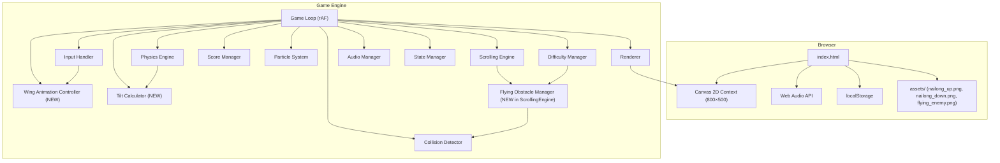

# Design Document: Visual Overhaul

## Overview

The Visual Overhaul upgrades Flappy Kiro from a portrait-oriented game with a simple ghost sprite into a landscape-format game featuring a custom winged character (Nailong) with three-tier wing animation, velocity-based tilt, styled pipe caps, and flying enemy obstacles at higher difficulty. These changes are primarily visual and additive — the core physics, collision, and scoring systems remain intact, with extensions only where new game objects (flying obstacles) require collision detection and difficulty scaling.

**Key Design Decisions:**

- **Canvas reorientation (480×640 → 800×500):** All subsystems already read dimensions from CONFIG; updating the values propagates automatically. Aspect ratio CSS scaling is already in place and works for any ratio.
- **Nailong character:** Replaces Ghosty with a two-frame sprite animation system. The circular hitbox model is preserved. Wing speed is driven by input state, not physics state, creating a visual-only feedback system layered on top of existing mechanics.
- **Character tilt:** A purely visual rotation derived from `ghost.velocity`. The collision hitbox remains an unrotated circle, so tilt has zero gameplay impact.
- **Pipe caps:** Decorative wider rectangles drawn at gap-facing edges of each pipe. Collision detection continues to use the narrower pipe body dimensions for fairness.
- **Flying obstacles:** A new hazard type managed by the existing object pool pattern, spawned by ScrollingEngine, checked by CollisionDetector, and difficulty-scaled by DifficultyManager. Activates at score ≥ 30.

## Architecture

### Modified High-Level Architecture



### Updated Game Loop Pipeline

The frame pipeline adds two new steps (wing animation and tilt calculation) and extends existing steps:

```mermaid
sequenceDiagram
    participant Loop as GameLoop
    participant Input as InputHandler
    participant State as StateManager
    participant Physics as PhysicsEngine
    participant Wing as WingAnimController
    participant Tilt as TiltCalculator
    participant Scroll as ScrollingEngine
    participant Coll as CollisionDetector
    participant Diff as DifficultyManager
    participant Score as ScoreManager
    participant Part as ParticleSystem
    participant Render as Renderer

    Loop->>Loop: Calculate deltaTime (clamped)
    Loop->>Input: pollInputs()
    Loop->>State: processStateTransitions(inputs)
    Loop->>Physics: update(ghost, dt)
    Loop->>Wing: update(dt, inputState, gameState)
    Loop->>Tilt: calculate(ghost.velocity)
    Loop->>Scroll: update(gameObjects, dt, difficulty, state, score)
    Loop->>Coll: check(ghost, pipes, flyingObstacles, boundaries)
    Loop->>Diff: evaluate(score)
    Loop->>Score: update(ghost, pipes, collectibles)
    Loop->>Part: update(ghost, dt)
    Loop->>Render: draw(gameState)
```

### Updated Render Order (Z-index back to front)

1. Sky background fill (`#87CEEB`)
2. Far parallax clouds
3. Mid parallax clouds
4. Near parallax clouds
5. Pipes with caps (batched fill + stroke + cap rendering)
6. Collectibles (rounded rects with oscillation)
7. Flying obstacles (image-based enemies)
8. Particle trail
9. Nailong sprite (with tilt rotation and wing frame selection)
10. Score popups
11. HUD bar (centered score text)
12. Overlays (pause/gameover/ready)

## Components and Interfaces

### 1. Wing Animation Controller (NEW)

Manages the three-tier wing animation speed based on player input state.

```javascript
// WingAnimController interface
{
  update(dt: number, jumpTriggeredThisFrame: boolean, jumpHeld: boolean, gameState: string): void
  getCurrentFrame(): 'up' | 'down'
  reset(): void
}
```

**Internal State:**
- `currentFrame`: 'up' or 'down'
- `frameTimer`: ms elapsed in current frame
- `currentRate`: current ms-per-frame (determines animation speed)
- `tier`: 'base' | 'jump' | 'rapid'
- `jumpBoostTimer`: ms remaining in the jump-tier boost window

**Tier Logic:**
| Tier | Rate (ms/frame) | Trigger | Duration |
|------|-----------------|---------|----------|
| Base | 250–350ms | Default / no input | Continuous |
| Jump | 120–180ms | Single jump press | 200–400ms then revert |
| Rapid | 60–100ms | Held key (rapid jumping) | While held |

**Rapid Detection:**
The controller tracks timestamps of recent jump inputs. If two jumps occur within 200ms of each other, it transitions to Rapid tier. On release (no jump input for >200ms), it reverts to Base.

**State Behavior:**
- Ready: animate at Base rate (alongside idle bob)
- Playing: animate at current tier rate
- Paused: freeze (don't advance timer)
- Game Over: freeze at current frame

### 2. Tilt Calculator (NEW)

Computes the visual rotation angle for Nailong based on vertical velocity.

```javascript
// TiltCalculator interface
{
  calculate(velocity: number, config: TiltConfig): number  // Returns angle in radians
}
```

**Algorithm:**
```javascript
function calculateTilt(velocity, config) {
  if (velocity > 0) {
    // Descending: clockwise (positive rotation)
    const t = Math.min(velocity / config.maxDescentVelocity, 1.0);
    return t * config.maxDownTilt;  // e.g., 0.6 rad (~35°)
  } else if (velocity < 0) {
    // Ascending: counter-clockwise (negative rotation)
    const t = Math.min(-velocity / config.maxAscentVelocity, 1.0);
    return -t * config.maxUpTilt;   // e.g., -0.4 rad (~23°)
  }
  return 0; // Level
}
```

**Config Values (added to CONFIG.character):**
| Parameter | Value | Notes |
|-----------|-------|-------|
| maxDownTilt | 0.6 rad (~35°) | Max clockwise rotation when falling |
| maxUpTilt | 0.4 rad (~23°) | Max counter-clockwise when rising |
| maxDescentVelocity | 600 (terminal down) | Velocity at which max down-tilt is reached |
| maxAscentVelocity | 400 (terminal up magnitude) | Velocity at which max up-tilt is reached |

**Key Constraint:** Tilt is purely visual. The collision hitbox is always an axis-aligned circle centered on `(ghost.x + width/2, ghost.y + height/2)`.

### 3. ScrollingEngine Extensions (Flying Obstacles)

The existing ScrollingEngine gains methods for flying obstacle management:

```javascript
// New methods on ScrollingEngine
{
  spawnFlyingObstacle(difficulty: DifficultyParams, score: number): FlyingObstacle | null
  updateFlyingObstacles(flyingObstacles: FlyingObstacle[], dt: number, state: string): void
  removeFlyingObstacleOffscreen(flyingObstacles: FlyingObstacle[]): void
}
```

**Spawn Logic:**
- Only spawns when `score >= CONFIG.flyingObstacles.activationThreshold` (30)
- Spawn timer tracks interval; on expiry, spawn if `activeCount < CONFIG.flyingObstacles.maxOnScreen` (2)
- Spawn interval decreases with score (3–5s at threshold → 1.5–2.5s at max difficulty)
- Vertical position: random between 15%–85% of playable height
- Horizontal position: just off right edge of canvas (800 + obstacle width)

**Movement:**
- Each obstacle moves left at `pipeSpeed * speedMultiplier`
- Speed multiplier scales from 1.2× at activation to 2.0× at max difficulty

### 4. CollisionDetector Extensions

The existing CollisionDetector gains a method for flying obstacle collision:

```javascript
// New method on CollisionDetector
{
  checkFlyingObstacles(ghost: Ghost, flyingObstacles: FlyingObstacle[]): { collided: boolean }
}
```

Uses the same `circleRectCollision` algorithm. The flying obstacle hitbox is its bounding rectangle (x, y, width, height).

### 5. DifficultyManager Extensions

The existing DifficultyManager's `evaluate()` return type extends to include flying obstacle parameters:

```javascript
// Extended DifficultyParams
{
  pipeSpeed: number,
  gapHeight: number,
  pipeSpacing: number,
  // NEW:
  flyingObstacleSpeedMultiplier: number,  // 1.2 → 2.0
  flyingObstacleSpawnInterval: number     // 3000–5000ms → 1500–2500ms
}
```

**Scaling Formula (score ≥ 30 only):**
```
obstacleScore = score - activationThreshold  // score relative to activation
obstacleTier = floor(obstacleScore / 10)
speedMultiplier = min(1.2 + obstacleTier * 0.2, 2.0)
spawnInterval = max(baseInterval - obstacleTier * intervalDecrement, minInterval)
```

### 6. Renderer Modifications

**Nailong Rendering (replaces Ghost):**
```javascript
function renderNailong(ctx, ghost, wingFrame, tiltAngle, sprites) {
  ctx.save();
  ctx.translate(ghost.x + ghost.width / 2, ghost.y + ghost.height / 2);
  ctx.rotate(tiltAngle);
  const sprite = wingFrame === 'up' ? sprites.nailongUp : sprites.nailongDown;
  if (sprite) {
    ctx.drawImage(sprite, -ghost.width / 2, -ghost.height / 2, ghost.width, ghost.height);
  } else {
    // Fallback: white circle
    ctx.fillStyle = '#ffffff';
    ctx.beginPath();
    ctx.arc(0, 0, ghost.width / 2, 0, Math.PI * 2);
    ctx.fill();
  }
  ctx.restore();
}
```

**Pipe Cap Rendering:**
```javascript
function renderPipeCaps(ctx, pipes, config) {
  const capOverhang = config.pipes.capOverhang;   // 8px each side
  const capHeight = config.pipes.capHeight;       // 25px
  const capRadius = config.pipes.capBorderRadius; // 4px
  const capColor = config.pipes.capColor;         // darker green

  ctx.fillStyle = capColor;
  for (const pipe of pipes) {
    const topPipeBottom = pipe.gapCenterY - pipe.gapHeight / 2;
    const botPipeTop = pipe.gapCenterY + pipe.gapHeight / 2;
    const capX = pipe.x - capOverhang;
    const capWidth = pipe.width + capOverhang * 2;

    // Top pipe cap (at bottom of top pipe, facing gap)
    drawRoundedRect(ctx, capX, topPipeBottom - capHeight, capWidth, capHeight, capRadius);
    // Bottom pipe cap (at top of bottom pipe, facing gap)
    drawRoundedRect(ctx, capX, botPipeTop, capWidth, capHeight, capRadius);
  }
  ctx.fill();
}
```

**Flying Obstacle Rendering:**
```javascript
function renderFlyingObstacles(ctx, obstacles, sprite) {
  for (const obs of obstacles) {
    if (sprite) {
      ctx.drawImage(sprite, obs.x, obs.y, obs.width, obs.height);
    } else {
      // Fallback: red circle
      ctx.fillStyle = '#e74c3c';
      ctx.beginPath();
      ctx.arc(obs.x + obs.width / 2, obs.y + obs.height / 2, obs.height / 2, 0, Math.PI * 2);
      ctx.fill();
    }
  }
}
```

**HUD Changes:**
- Score text and high score text are drawn centered horizontally in the HUD bar (using `ctx.textAlign = 'center'` at `canvas.width / 2`)
- Game Over text rendered in red (#e74c3c) instead of white

### 7. CONFIG Extensions

New sections added to `game-config.json`:

```javascript
{
  "character": {
    "spriteWidth": 44,
    "spriteHeight": 44,
    "hitboxRadius": 16,
    "startX": 150,
    "startY": 250,
    "maxDownTilt": 0.6,
    "maxUpTilt": 0.4,
    "maxDescentVelocity": 600,
    "maxAscentVelocity": 400
  },
  "wingAnimation": {
    "baseRateMin": 250,
    "baseRateMax": 350,
    "jumpRateMin": 120,
    "jumpRateMax": 180,
    "rapidRateMin": 60,
    "rapidRateMax": 100,
    "jumpBoostDuration": 300,
    "rapidDetectionWindow": 200
  },
  "pipes": {
    "capOverhang": 8,
    "capHeight": 25,
    "capBorderRadius": 4,
    "capColor": "#1a7a28"
  },
  "flyingObstacles": {
    "activationThreshold": 30,
    "maxOnScreen": 2,
    "baseSpawnIntervalMin": 3000,
    "baseSpawnIntervalMax": 5000,
    "minSpawnIntervalMin": 1500,
    "minSpawnIntervalMax": 2500,
    "spawnIntervalDecrement": 400,
    "baseSpeedMultiplier": 1.2,
    "maxSpeedMultiplier": 2.0,
    "speedMultiplierIncrement": 0.2,
    "spawnYMinPercent": 0.15,
    "spawnYMaxPercent": 0.85,
    "heightRatio": 0.75,
    "poolSize": 4
  },
  "canvas": {
    "width": 800,
    "height": 500,
    "hudHeight": 40
  }
}
```

## Data Models

### Updated Ghost/Nailong Object

```javascript
{
  x: 150,              // Fixed horizontal position (left quarter of 800)
  y: 250,              // Vertical position (center of 500)
  width: 44,           // Sprite width
  height: 44,          // Sprite height
  velocity: 0,         // Vertical velocity px/s
  hitboxRadius: 16,    // Circular hitbox radius
  tiltAngle: 0         // Current visual rotation in radians (derived each frame)
}
```

### Wing Animation State

```javascript
{
  currentFrame: 'up',       // 'up' | 'down'
  frameTimer: 0,            // ms elapsed in current frame
  currentRate: 300,         // ms per frame (current tier rate)
  tier: 'base',             // 'base' | 'jump' | 'rapid'
  jumpBoostTimer: 0,        // ms remaining in jump-tier boost
  lastJumpTime: 0           // timestamp of last jump (for rapid detection)
}
```

### Flying Obstacle Object

```javascript
{
  x: number,           // Horizontal position (starts at 800 + width)
  y: number,           // Vertical position (15%-85% of playable height)
  width: number,       // Scaled from source image aspect ratio
  height: number,      // ~75% of Nailong height (e.g., 33px if Nailong is 44px)
  speed: number,       // pipeSpeed * speedMultiplier
  active: boolean      // Whether currently in play
}
```

### Flying Obstacle Pool

```javascript
// Pool size: 4 (max 2 on screen + 2 buffer)
// Same ObjectPool pattern as pipes/collectibles
const flyingObstaclePool = createPool(() => ({
  x: 0, y: 0, width: 0, height: 0, speed: 0, active: false
}), CONFIG.flyingObstacles.poolSize);
```

### Updated Pipe Cap Rendering Data (derived, not stored)

Pipe caps are computed at render time from existing pipe data — no additional data model needed. The cap dimensions are derived from CONFIG values and the pipe's current position/gap.

### Updated CONFIG Canvas Section

```javascript
CONFIG.canvas = {
  width: 800,
  height: 500,
  hudHeight: 40,
  targetFps: 60,
  maxDt: 0.033,
  backgroundColor: '#87CEEB'
}
```

## Correctness Properties

*A property is a characteristic or behavior that should hold true across all valid executions of a system — essentially, a formal statement about what the system should do. Properties serve as the bridge between human-readable specifications and machine-verifiable correctness guarantees.*

### Property 1: Tilt is proportional to velocity with correct sign and asymmetric bounds

*For any* vertical velocity value, the tilt calculator SHALL return:
- A positive angle (clockwise) proportional to velocity when velocity > 0 (descending)
- A negative angle (counter-clockwise) proportional to |velocity| when velocity < 0 (ascending)
- Zero when velocity is exactly 0
- A maximum descending tilt magnitude that is strictly greater than the maximum ascending tilt magnitude (maxDownTilt > maxUpTilt)
- An angle whose absolute value never exceeds the configured maximum for its direction

**Validates: Requirements 3.1, 3.2, 3.3, 3.4**

### Property 2: Tilt does not affect collision hitbox

*For any* ghost velocity (producing any tilt angle), the collision hitbox returned by the ghost SHALL remain an axis-aligned circle with center at `(ghost.x + width/2, ghost.y + height/2)` and radius equal to `ghost.hitboxRadius`, independent of the current tilt angle.

**Validates: Requirements 3.5**

### Property 3: Wing animation tier state machine

*For any* sequence of update calls with jump inputs:
- In the absence of jump inputs in Playing state, the wing rate SHALL be within Base_Wing_Rate bounds (250–350ms)
- After a single jump input, the wing rate SHALL transition to Jump_Wing_Rate bounds (120–180ms) and revert to Base_Wing_Rate after 200–400ms
- When multiple jump inputs arrive within 200ms of each other (rapid), the wing rate SHALL be within Rapid_Wing_Rate bounds (60–100ms) for the duration
- After the last rapid jump, once 200ms elapses with no jump input, the wing rate SHALL revert to Base_Wing_Rate

**Validates: Requirements 2.2, 2.3, 2.4, 2.5, 2.6**

### Property 4: Wing animation freezes in inactive game states

*For any* wing animation state and any positive delta-time, when the game state is Paused or Game_Over, updating the wing animation controller SHALL leave the currentFrame and frameTimer completely unchanged.

**Validates: Requirements 2.10, 2.11**

### Property 5: Collision detection uses pipe body dimensions only (not caps)

*For any* ghost position that is within the pipe cap overhang area (between `pipe.x - capOverhang` and `pipe.x`, or between `pipe.x + pipe.width` and `pipe.x + pipe.width + capOverhang`) but NOT within the pipe body rectangle (`pipe.x` to `pipe.x + pipe.width`), the collision detector SHALL report no collision.

**Validates: Requirements 4.6**

### Property 6: Flying obstacle activation threshold

*For any* score value less than 30, the scrolling engine SHALL never spawn a flying obstacle. *For any* score value greater than or equal to 30, the spawn system SHALL be eligible to produce flying obstacles.

**Validates: Requirements 5.1**

### Property 7: Flying obstacle spawn Y position within bounds

*For any* spawned flying obstacle, its vertical position SHALL be between 15% and 85% of the playable area height (canvas height minus HUD height).

**Validates: Requirements 5.2**

### Property 8: Flying obstacle speed multiplier within bounds and monotonically increasing

*For any* score ≥ 30, the flying obstacle speed multiplier SHALL be within [1.2, 2.0] times the current pipe speed, and *for any* two scores s1 < s2 (both ≥ 30), the speed multiplier at s2 SHALL be greater than or equal to the speed multiplier at s1.

**Validates: Requirements 5.3, 5.5**

### Property 9: Flying obstacle spawn interval within bounds and monotonically decreasing

*For any* score ≥ 30, the flying obstacle spawn interval SHALL be within [1500, 5000] milliseconds, and *for any* two scores s1 < s2 (both ≥ 30), the spawn interval at s2 SHALL be less than or equal to the spawn interval at s1.

**Validates: Requirements 5.4**

### Property 10: Flying obstacle count cap

*For any* sequence of spawn attempts at any difficulty level, the number of active (on-screen) flying obstacles SHALL never exceed 2 at any point in time.

**Validates: Requirements 5.6**

### Property 11: Flying obstacle circle-rect collision correctness

*For any* ghost circle (cx, cy, r) and flying obstacle rectangle (rx, ry, rw, rh), the collision detector SHALL return collided=true if and only if the distance from the circle center to the nearest point on the rectangle is less than or equal to the radius.

**Validates: Requirements 5.7**

### Property 12: Flying obstacle off-screen removal

*For any* flying obstacle whose right edge (x + width) is less than zero, after the removal pass that obstacle SHALL no longer exist in the active flying obstacles array and SHALL be returned to the pool.

**Validates: Requirements 5.9**

### Property 13: Flying obstacles freeze in non-playing states

*For any* set of active flying obstacles and any positive delta-time, when the game state is Paused, all flying obstacle positions SHALL remain unchanged. When the game state is Game_Over or Ready, no flying obstacles SHALL be spawned or moved.

**Validates: Requirements 5.10, 5.11**

### Property 14: Pipe gap centers within landscape bounds

*For any* generated pipe pair in the 800×500 canvas, the gap center vertical position SHALL be between 20% and 80% of the playable area height (500 - hudHeight).

**Validates: Requirements 1.6**

## Error Handling

### Asset Loading Failures

| Asset | Fallback |
|-------|----------|
| `nailong_up.png` | White circle of configured dimensions |
| `nailong_down.png` | White circle of configured dimensions |
| `flying_enemy.png` | Red filled circle of obstacle dimensions |

All asset loads use the standard `Image()` constructor with `onload`/`onerror` handlers. On error, the sprite reference is set to `null`, and the renderer checks for null before attempting `drawImage()`.

### Configuration Validation

- If CONFIG values for wing animation rates are outside sensible bounds (e.g., rate ≤ 0), fall back to hardcoded defaults.
- If flying obstacle pool cannot acquire (all in use), skip spawn for that frame.
- If canvas dimensions in CONFIG are invalid (≤ 0), fall back to 800×500.

### State Edge Cases

- Flying obstacles spawning exactly at score 30 boundary: handled by `>=` check.
- Wing animation controller receiving a dt of 0 (e.g., duplicate rAF callback): no-op, timer unchanged.
- Multiple state transitions in a single frame (e.g., playing → game_over during collision check): the state machine's transition validation prevents invalid sequences.

## Testing Strategy

### Unit Tests (Example-Based)

Unit tests cover specific scenarios, edge cases, and rendering behavior:

- Canvas dimensions are 800×500 in CONFIG
- Character start position is (150, 250)
- HUD text is centered (textAlign = 'center', x = 400)
- Game Over text uses red color (#e74c3c)
- Wing animation runs at base rate in Ready state
- Sprite fallback renders circle when image is null
- Pipe cap positioning: top cap at `gapCenterY - gapHeight/2 - capHeight`, bottom cap at `gapCenterY + gapHeight/2`
- Flying obstacle height is 75% of character height

### Property-Based Tests (fast-check)

Property-based tests validate universal properties across generated inputs. The project already uses fast-check (via Vitest) for property testing.

**Configuration:**
- Library: `fast-check` (already in project dependencies)
- Runner: Vitest with `--run` flag
- Minimum iterations: 100 per property
- Tag format: `Feature: visual-overhaul, Property {N}: {description}`

**Properties to implement:**

1. **Tilt calculation** (Property 1): Generate random velocities in [-600, 600], verify sign, proportionality, bounds, and asymmetry.
2. **Hitbox independence** (Property 2): Generate random velocities, compute tilt, verify hitbox unchanged.
3. **Wing tier state machine** (Property 3): Generate random sequences of (dt, jumpInput) pairs, verify rate bounds match expected tier at each point.
4. **Wing freeze** (Property 4): Generate random wing states and dt values, verify no mutation in paused/game_over.
5. **Cap collision exclusion** (Property 5): Generate ghost positions in cap-only zones, verify no collision.
6. **Obstacle activation threshold** (Property 6): Generate random scores [0, 100], verify spawn eligibility.
7. **Obstacle spawn Y bounds** (Property 7): Generate spawn calls with random seeds, verify Y within [15%, 85%] of playable height.
8. **Speed multiplier bounds** (Property 8): Generate scores [30, 200], verify multiplier in [1.2, 2.0] and monotonic.
9. **Spawn interval bounds** (Property 9): Generate scores [30, 200], verify interval in [1500, 5000] and monotonically decreasing.
10. **Obstacle count cap** (Property 10): Generate rapid spawn sequences, verify count ≤ 2.
11. **Obstacle collision** (Property 11): Generate random circles and rectangles, verify collision matches mathematical formula.
12. **Obstacle off-screen removal** (Property 12): Generate obstacles with various x positions, verify removal when x + width < 0.
13. **Obstacle state freezing** (Property 13): Generate obstacle arrays and dt in paused/game_over, verify positions unchanged.
14. **Pipe gap bounds** (Property 14): Generate pipe pairs with random seeds, verify gapCenterY within [20%, 80%] of playable area.

### Integration Tests

- Full game loop frame with flying obstacles active at score 35, verifying spawn/move/collision pipeline works end-to-end
- Canvas resize event triggers correct CSS scaling
- Asset loading sequence completes before game loop starts

