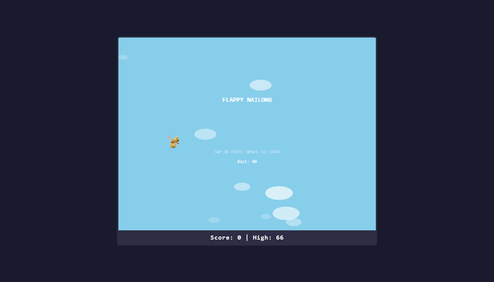
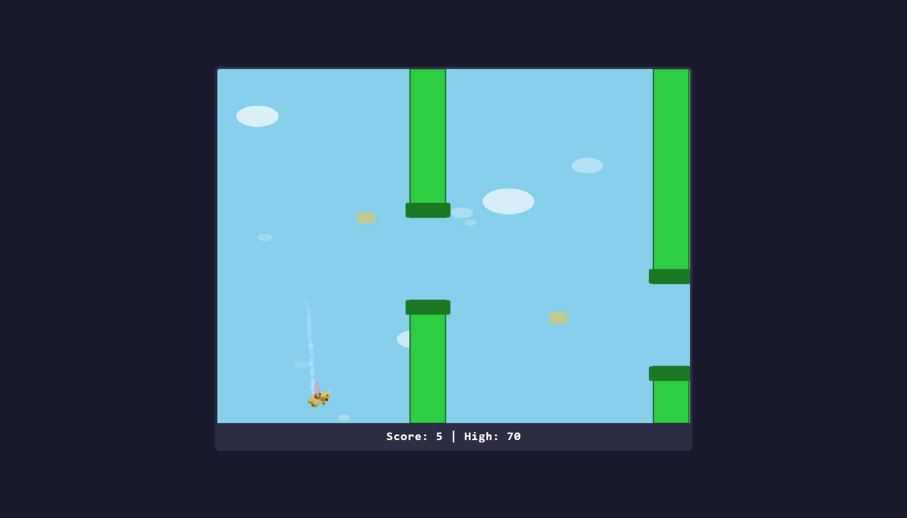
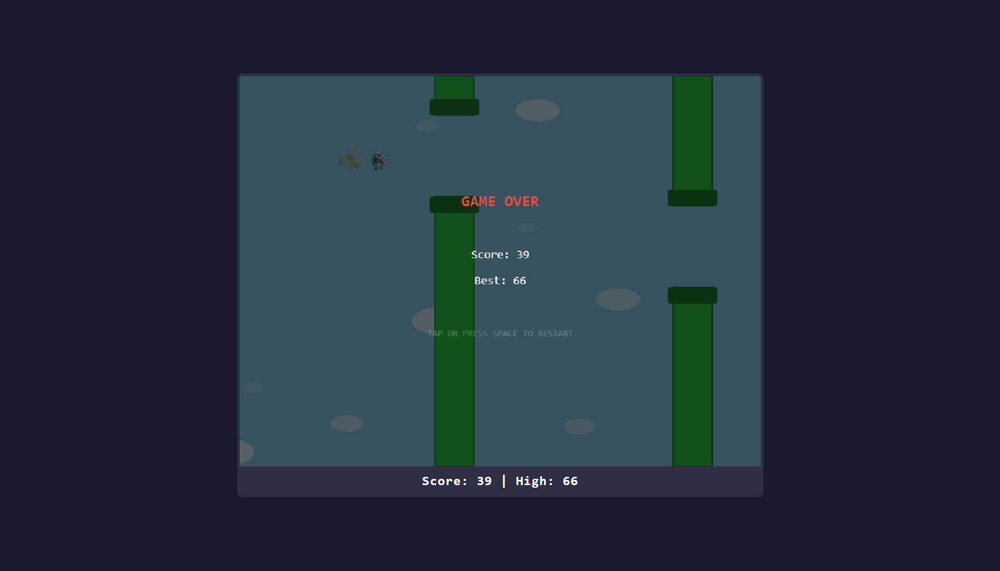
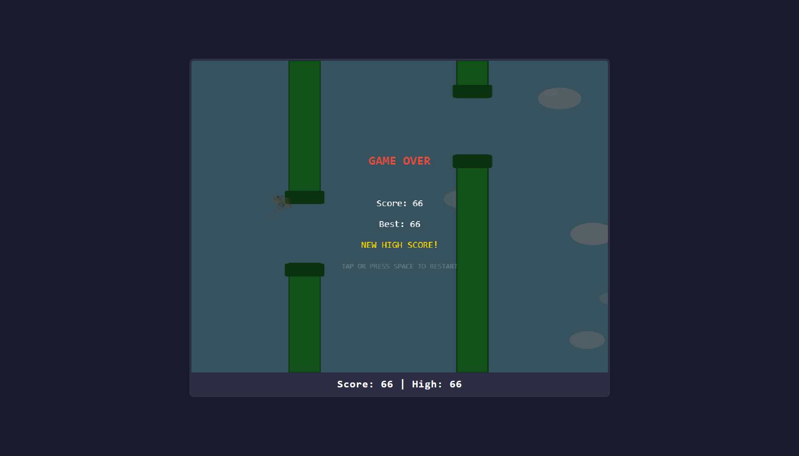
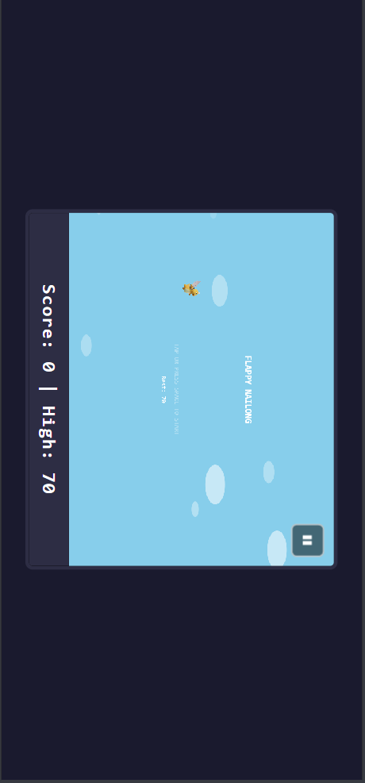

# Flappy Nailong

A Flappy Bird-inspired browser game featuring Nailong — a custom winged character with responsive wing animation, velocity-based tilt, styled pipes, and flying enemy obstacles at higher difficulty.

## Screenshots

### Start Screen


### Gameplay — Collectibles


### Game Over — Flying Object Was Hit


### New High Score


### Mobile View


---

## How to Play

- **Tap / Click / Press Space** — Jump
- **Hold Space / Hold Touch** — Rapid jump (continuous ascent)
- **Escape / P / Pause Button (mobile)** — Pause / Resume

Navigate Nailong through the gaps between green pipes. Each pipe passed scores 1 point. Golden collectibles between pipes award bonus points. Survive as long as you can — the game gets progressively harder.

## Game Mechanics

### Character — Nailong

- Two-frame wing animation (wings-up / wings-down sprites)
- **Single jump**: performs a calm wingbeat (down → up) then returns to the idle loop
- **Continuous tapping**: each tap instantly flips the wing frame for a rapid flapping effect
- **Rapid jump (hold space / hold touch)**: fast wing cycle with a locked ascending tilt — no jittery tilting during rapid ascent
- **Velocity-based tilt**: Nailong tilts forward (clockwise) when falling and backward when rising. The descending tilt is more pronounced than the ascending tilt. During rapid jumps, tilt is held steady at an upward angle and resumes normal behavior on release.

### Pipes

- Classic green pipes with darker rounded caps at the gap-facing edges
- Gap size, pipe speed, and spacing tighten every 10 points
- Pipe gaps are always positioned between 20%–80% of the playable area

### Flying Obstacles (Score ≥ 30)

- Enemy sprites that fly horizontally across the screen
- Same size as Nailong, with gentle vertical bobbing for natural movement
- Speed increases with score (1.2× to 2.0× pipe speed)
- Spawn rate increases as difficulty rises
- **Gap-avoidance logic**: obstacles predict which pipe gap the player will be threading and avoid spawning at that height, so they're always dodgeable
- Maximum 2 on screen at once
- Collision triggers game over

### Collectibles

- Golden rounded rectangles that float between pipes
- Award +5 bonus points on pickup
- Oscillate vertically for visibility
- Spawn probability: 30%–50% per pipe pair

### Difficulty Progression

| Score | Pipe Speed | Gap Size | Pipe Spacing |
|-------|-----------|----------|--------------|
| 0     | 120 px/s  | 140 px   | 350 px       |
| 30    | 165 px/s  | 125 px   | 305 px       |
| 50    | 195 px/s  | 115 px   | 275 px       |
| 100+  | 280 px/s  | 90 px    | 200 px       |

### Scoring

- +1 for each pipe pair passed
- +5 for collectibles (spawn between pipes)
- High score saved to localStorage

### Physics

- Gravity: 900 px/s²
- Jump velocity: -300 px/s (instant upward override)
- Terminal velocity: 600 px/s (down), -400 px/s (up)
- Frame-rate independent (delta-time based)

## Visual Design

- 800×600 canvas in a framed wrapper (rounded border, dark navy background)
- Separate score bar below the canvas showing current and high score
- Three-layer parallax clouds
- Particle trail behind Nailong while flying
- Screen shake on collision
- Score popups (+1 white, +5 gold)
- Game Over screen with red title text

## Mobile Support

- Responsive layout that scales to fit any screen
- Portrait mode auto-rotates to landscape for optimal gameplay
- Touch-hold for rapid jumping support (with slight delay to prevent accidental triggers)
- Dedicated pause button (top-right corner)

## Controls

| Input | Action |
|-------|--------|
| Space / Click / Tap | Jump |
| Hold Space / Hold Touch | Rapid jump |
| Escape / P / Pause Button | Pause / Resume |

## Running

Open `index.html` in a browser. No build step required.

## Testing

```bash
npm install
npx vitest run
```

390 tests across 32 files (unit tests + property-based tests with fast-check).

## Assets

- `assets/nailong_up.png` / `nailong_down.png` — Character sprites
- `assets/flying_enemy.png` — Flying obstacle sprite
- `assets/jump.wav` / `game_over.wav` — Sound effects
